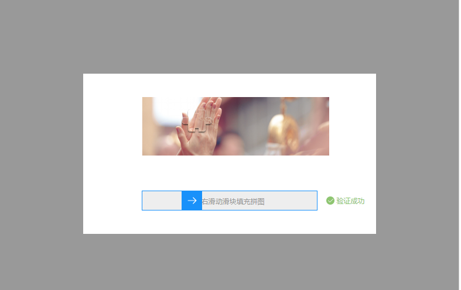
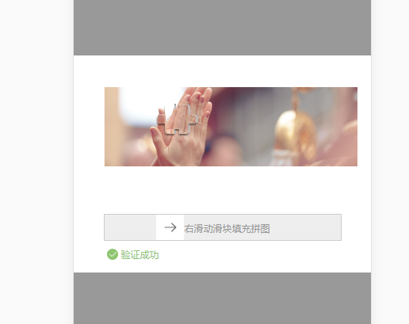

# verify 使用文档
- verify是同时支持PC端与移动端的图片拖拽验证，并配合后台使用校验的插件
- verify目前是跟后台配合使用的插件，后期有时间补上其前端自己实现图片的处理
- 效果如下
- pc端效果
 

- 移动端效果


## 使用方法

- 1.引入verify-1.0.1.js
- 2.使用 verify

```javascript
let verify = new Verify({
		imgUrl: '1.json',
		checkUrl: '1.json',
		callback: (data) => {
		    
		}
	});
 
```

### 相关参数

| 参数名 | 说明 | 类型 |
| - | :-: | -: | 
| imgUrl | 获取图片资源的请求地址 | string |
| checkUrl | 检查是否通过验证的请求地址 | string |
| callback | 通过验证后的回调函数 | function |

### 方法

```javascript
verify.showVerify();
```

### 相关说明
- 1.关于后台返回的字段的问题
- 2.请求图片资源返回的参数：{state: 0, data: {bgSrc: '背景图片的src地址', moveSrc:'要移动的图片src地址', posY: '图片距离上面的高度', token: '123456'}, 'msg': 'successs'}
- 3.请求校验的参数： {left: 102}，返回参数：{state: 0, data: {}, 'msg': 'success'}

- 4.使用方法showVerify()去显示verify插件